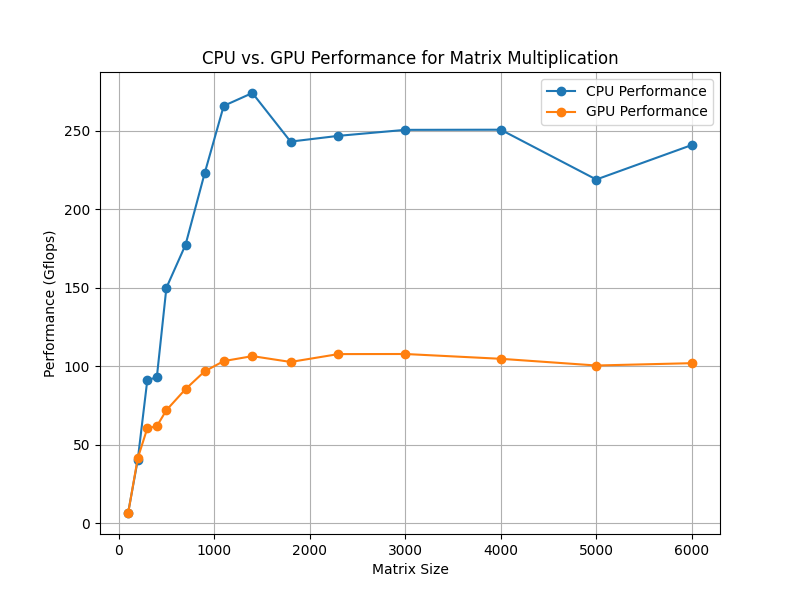

# CPU-vs-GPU-Matrix-Multiplication
This script will perform matrix multiplication using CPU computation with NumPy and then compare it with GPU computation using TensorFlow. 

## Matrix Multiplication Formula:
Let 
 be a 
 matrix and 
 be a 
 matrix. Then the 
 matrix 
 is the product of matrixes A and B and is denoted as 
, where the elements in the i th row and the j th column of the matrix 
 can be expressed as

## Calculatining the GFLOPs:

We can estimate the number of GigaFLOPS achieved for a specific matrix size and its corresponding execution time. GigaFLOPS is a common metric used to measure the performance of computations involving floating-point operations, such as matrix multiplication. Higher GigaFLOPS values generally indicate better performance, as it represents the number of operations the system can perform in one second.

**num_flops = 2 * matrix_size**3:**  
This calculates the total number of floating-point operations (FLOPs) required to perform matrix multiplication for two square matrices of size matrix_size x matrix_size. The matrix multiplication algorithm typically involves matrix_size**3 multiplications and matrix_size**3 - 1 additions for each element in the resulting matrix. Since we are dealing with two matrices, the total number of FLOPs is doubled, hence 2 * matrix_size**3.

**gflops = (num_flops / (execution_time * 1e9)):**  
This calculates the performance of the matrix multiplication operation in GigaFLOPS. execution_time represents the time taken to complete the matrix multiplication in seconds. The division num_flops / execution_time gives us the number of FLOPs per second, and dividing it by 1e9 converts it into GigaFLOPS.

## Performance Comparison:

